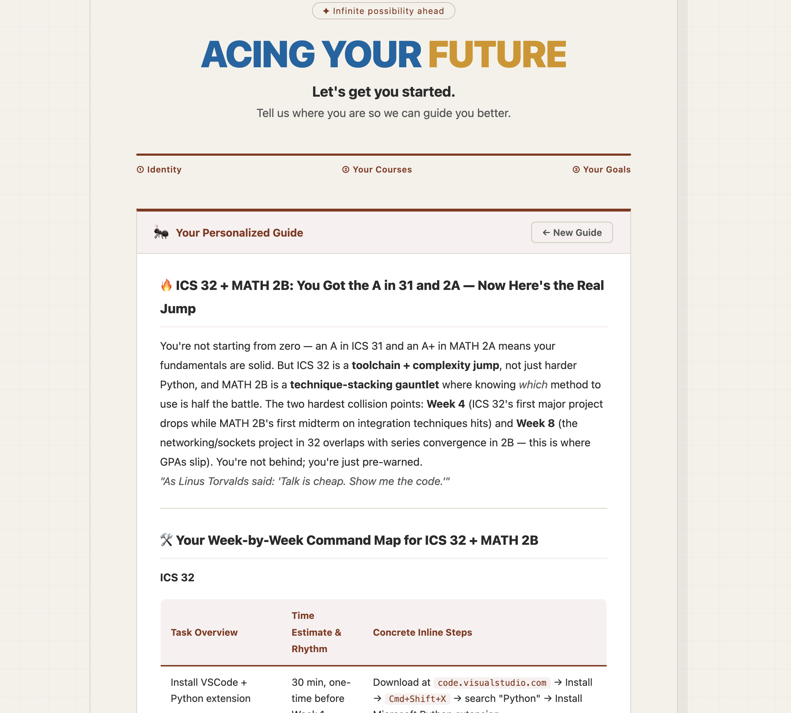

# AAF — Acing Your Future

<p align="center">
  
</p>

<p align="center">
  <i>An AI agent + community platform that turns "I have no idea how to approach and leverage this class"<br/>
  into a week-by-week plan — architected, built, debugged, and shipped solo, and running in production today.</i>
</p>

<p align="center">
  
  
  
  
  
  
  
  
  
  
</p>

<p align="center">
  <b><a href="https://aaf-product.vercel.app">Live App</a></b> ·
  <b><a href="https://aaf-api.onrender.com/docs">API Docs (Swagger)</a></b> ·
  <b><a href="ARCHITECTURE.md">Architecture Doc</a></b>
</p>

<p align="center"><sub>Backend is on Render's free tier — the first request after idle can take 30–60s to cold-start. That's a known, priced trade-off, not a bug (see <a href="#engineering-trade-offs-what-id-do-differently-at-scale">Trade-offs</a>).</sub></p>

<p align="center">
  
  <br/>
  <sub><i>Not a mockup — this is a live-generated guide, running against production right now.</i></sub>
</p>

## Table of Contents

- [Why I Built This](#why-i-built-this)
- [What It Does](#what-it-does)
- [Live in Production](#live-in-production)
- [Architecture and Why This Stack](#architecture-and-why-this-stack)
- [The Hardest Problems I Solved](#the-hardest-problems-i-solved)
- [Debugging War Stories](#debugging-war-stories)
- [Testing](#testing)
- [From Prototype to Production: The Real Timeline](#from-prototype-to-production-the-real-timeline)
- [Roadmap: Vision 2.0](#roadmap-vision-20)
- [Engineering Trade-offs (What I'd Do Differently at Scale)](#engineering-trade-offs-what-id-do-differently-at-scale)
- [Quick Start](#quick-start)
- [API Reference](#api-reference)
- [Project Structure](#project-structure)

---

## Why I Built This

I watched the same story repeat every quarter: a student walks into ICS 32 fresh off an A in ICS 31, and gets flattened — not by the material, but by everything around it. Nobody tells you that ICS 32 is a *toolchain and complexity* jump, not just "harder Python." Nobody tells you Week 4 is when the first major project collides with a midterm, or that the syllabus assumes you've already set up VS Code, a linter, and a mental model for debugging someone else's code. That gap — between what the syllabus assumes and what a first-year actually knows — is where imposter syndrome and retakes come from. It's a resource-allocation problem wearing a psychological costume.

I also noticed the fix was sitting right there, unused: every quarter, a fresh batch of students survives the exact same course and immediately forgets everything that would have helped the *next* batch. UCI's own alumni are its best untapped dataset, and nothing was capturing it.

So AAF (**A**nteater **A**cing the **F**uture) isn't a generic "ChatGPT wrapper for homework." It's a hyper-local agent that only knows about UCI courses, fused with a community flywheel that gets smarter every time a senior who survived a class writes down what they wish they'd known. The name started life as "Anteater Tutor AI" in my first brainstorm; it became "AAF — Acing Your Future" once I'd built enough of it to see the shape of the real product — an anteater theme felt right for a UCI-only tool built by a UCI student, for UCI students (yes, the `frontend/public/images.png` above is the same "Zot Zot Zot" spirit the whole campus already shares — Peter the Anteater's cheer).

## What It Does

AAF runs a **three-step onboarding wizard** (Identity → Courses → Goals) that branches into two roles:

- **Learners** — students who pick their current courses, a confidence level (0–10), and their goals, then get back an AI-generated, course-specific guide.
- **Seniors** — students who've already taken the course and want to hand down what they learned, in exchange for real career-facing perks (not just points).

For Learners, the `/guide/generate` endpoint fans out **concurrently** (`asyncio.gather`) across two sources — the internal knowledge base and the live web — and hands both to Claude:

1. **Internal RAG retrieval** (ChromaDB) — semantic search over every approved senior contribution for the selected course(s).
2. **Live web search** (Tavily, student role only) — two targeted queries (`{course} UCI professor exam difficulty study tips reddit` / `{course} UCI internship career relevance`), with results tagged by source at ingestion (`📌 r/UCI`, `🎓 UCI Official`, `⭐ RateMyProfessors`, `💼 Blind`, `🔗 LinkedIn`, `🌐 Web`) and deduplicated.
3. **Claude (`claude-sonnet-4-6`)** synthesizes both into a structured guide: a workload-and-mindset briefing naming the specific weeks that will hurt and why, a **week-by-week Markdown table** per course with concrete, copy-pasteable steps ("`Cmd+Shift+X` → search Python → Install"), the 2–3 most relevant senior tips paraphrased with commentary on *why* they matter, and one hyper-specific next move.

For Seniors, the same endpoint skips the web search, writes their tip into the review queue instead, and Claude responds with a short, warm confirmation instead of a full guide — different role, different contract, same endpoint.

Everything downstream of that first guide is a completed product loop, not a demo stub:

- **Auth** — JWT access + refresh tokens, bcrypt-hashed passwords, working register/login/refresh/me.
- **History & sharing** — logged-in users get a paginated guide history; every guide also gets a permanent, anonymously-viewable `/guide/:id` link (true "share this with a friend" semantics).
- **Feedback loop** — an emoji rating widget that actually posts to `/ratings` and persists (the original version silently discarded every rating — see [Debugging War Stories](#debugging-war-stories)).
- **Contribution + moderation pipeline** — seniors submit course intel through an in-app form; an admin dashboard lists, approves, or rejects submissions; approval writes straight into ChromaDB, so the next guide for that course is smarter *immediately*.
- **Export menu** — Add to Calendar (`.ics`), Download as PDF, Export for Google Docs, Share.

## Live in Production

This isn't a local demo — it's a real, deployed system with real usage behind it:

| | |
|---|---|
| **Frontend** | [aaf-product.vercel.app](https://aaf-product.vercel.app) — Vercel |
| **Backend** | [aaf-api.onrender.com](https://aaf-api.onrender.com) — Render, auto-documented at `/docs` |
| **Knowledge base** | 23 real UCI senior course-experience entries, seeded from an original Google Form campaign and now living in Supabase as the system of record |
| **Feedback** | Emoji ratings persist to a real `ratings` table tied to every guide generated |
| **Resilience** | Verified locally that the vector store fully self-heals from empty on cold start — the exact failure mode a production redeploy triggers (see below) |

This project also has a real before-and-after: the current FastAPI/React system is a from-scratch re-architecture of a Flask MVP I shipped and ran in production first — real users hit real bugs (gunicorn timeouts, search API limits, missing timeouts) months before I ever wrote a line of the "proper" version. The rewrite wasn't a resume exercise; it was informed by production scars.

## Architecture and Why This Stack

Every choice below was made against a specific constraint, not "what's trendy." The full contract lives in [ARCHITECTURE.md](ARCHITECTURE.md); this is the *why*.

| Layer | Choice | Why |
|---|---|---|
| Backend framework | **FastAPI**, `async`/`await` throughout | The core request (`/guide/generate`) needs to hit ChromaDB and Tavily at the same time, not one after another. `asyncio.gather` over both, instead of Flask's serial calls, removes a full network round-trip from every request. |
| Validation layer | **Pydantic v2** (`BaseSettings`, `Field` constraints, `Literal` role enums) | One source of truth for config (zero hardcoded secrets) and for API contracts — invalid input (e.g. `confidence` outside 0–10) is rejected before it reaches business logic. |
| Relational DB | **Supabase Postgres**, via `SQLAlchemy 2.0 async` + `asyncpg` | Managed Postgres means zero ops burden for a solo build, while still getting real relational integrity for users/guides/ratings/contributions. |
| Vector store | **ChromaDB**, kept local/embedded rather than migrated to `pgvector` | Deliberately *not* folding the vector store into the relational one — simpler mental model, and (see below) the persistence problem this created had a cleaner fix than a database migration would have been. |
| AI | **Claude (`claude-sonnet-4-6`)** via `AsyncAnthropic`, 90s timeout, `temperature=0.65` | A single, carefully engineered system prompt enforces UCI-specific density (no "study hard" filler), a fixed 4-section output contract, a strict Markdown table schema for the weekly plan, and a completely different (shorter, community-focused) contract for the senior role — all in one prompt, not a chain of calls. |
| Search | **Tavily**, gated to the student role, 2 targeted queries | Source-tagged and deduplicated on ingestion so the model gets signal, not a link dump; capped to keep response time and API spend predictable. |
| Auth | **JWT** (access + refresh) + `bcrypt` | An `Optional[User]` dependency (`get_optional_user`) shares the exact same DB session as the required-auth dependency (`get_current_user`) — one code path serves both anonymous guide generation and personalized history, no duplicated logic. |
| Rate limiting | **`asyncio.Lock` sliding window**, in-process (5 requests / 60s / IP) | Right-sized for the actual deployment (single Render instance) instead of standing up Redis to solve a problem that doesn't exist yet. The ceiling — this resets per-instance under horizontal scaling — is a documented, accepted boundary, not a blind spot. |
| Frontend | **React 19 + Vite + TypeScript** | Fast HMR for iteration speed; the original plan called for React 18, but 19 had shipped stable by the time Phase 4 started, and there was no reason to target an older version on a greenfield frontend. |
| Client state | **Zustand** (wizard steps, auth tokens) vs. **TanStack Query** (everything server-owned) | A hard line between "what the user is doing right now" and "what the server told us" — no server data duplicated into client state, no manual cache invalidation bugs. |
| Markdown | **`react-markdown` + `remark-gfm` + `rehype-raw`** | Replaces a CDN `marked.js` `<script>` tag with a real dependency that correctly renders Claude's GFM tables — the entire "week-by-week plan" feature is a Markdown table Claude generates. |
| Styling | **Tailwind v4** for net-new screens; original hand-rolled CSS preserved byte-for-byte for migrated screens | Mid-migration I discovered the original app never actually used Tailwind, despite the initial plan assuming it did — it was 1,000+ lines of hand-written CSS with custom properties. Rather than risk a pixel-perfect UI on a deadline, I made the call to freeze the legacy CSS untouched for existing screens and use Tailwind only where there was no visual contract to honor. Documented, not accidental. |
| CORS | **Vite dev proxy** (local) + **`CORSMiddleware` allowlist** (prod), never `*` | Belt-and-suspenders: locally, the browser only ever sees same-origin requests (Proxy strips CORS from the problem entirely); in production, an explicit origin allowlist read from an env var is the only thing that can say yes. |
| Deployment | **Render** (backend) + **Vercel** (frontend) | Split matches the workloads: a long-lived Python process with a persistent-ish local vector store vs. a static SPA build on a global CDN. |

## The Hardest Problems I Solved

**1. A ~1-minute guide was actually a client-construction bug, not an AI latency problem.**
Early on, every guide took close to a minute to generate, and the obvious suspect was Claude. It wasn't. `chromadb.PersistentClient()` re-opens the on-disk store *and* re-binds the embedding model every time it's constructed — and the RAG service was building a fresh client on every call, once per selected course, on every single request. The fix was one line of restructuring: hoist the client and collection to module-level singletons, created once per process and reused. Tracing a latency complaint to "we're reloading an embedding model per HTTP request" instead of blaming the LLM is the kind of bug that only shows up if you actually profile instead of assume.

**2. Making a stateful vector database survive a stateless container.**
Render's web services run on an ephemeral filesystem — every redeploy (and every free-tier sleep/wake cycle) wipes local disk. ChromaDB is a file-backed vector store. Naively deployed, the entire community knowledge base would evaporate on the next deploy.

I considered two easy-but-wrong answers: pay for a persistent disk (solves it, costs money for a problem that doesn't need money), or rebuild the collection from the original seed CSV on every cold start (free, but silently throws away every contribution a real senior submits after that CSV snapshot — a correctness bug wearing a deployment-fix costume).

What I actually shipped: Supabase's `contributions` table became the single source of truth (`is_approved = true`), not the CSV. A `lifespan` hook re-queries Supabase and rebuilds the ChromaDB collection on *every* cold start, using the exact same `build_tip_text()` formatter that the real-time "admin approves a submission" path uses — so bulk reseed and incremental writes can never drift into two different tip formats. I validated this wasn't just a plan: I manually emptied the local collection to zero documents, cold-started the app with no manual scripts, and confirmed it self-healed to the full corpus — reproducing, on demand, the exact failure mode a real Render redeploy would trigger. "Works when I run it" and "works when the platform pulls the rug out" are different claims, and the production acceptance checklist calls for re-confirming this against a live redeploy before final sign-off.

## Debugging War Stories

<details>
<summary><b>Expand for three root-cause deep-dives</b> — a rate-limited request is easy to see; these weren't.</summary>

**ChromaDB's telemetry errors survived three separate fix attempts.** Every RAG call logged a `capture() takes 1 positional argument but 3 were given` error — cosmetic, but noisy. Attempt 1 (pass `ChromaSettings(anonymized_telemetry=False)` per-client) failed because ChromaDB's telemetry is a class-level singleton locked in at first construction; per-client settings can't retroactively change it. Attempt 2 (`ANONYMIZED_TELEMETRY=False` in `.env`) failed because `pydantic-settings`'s `env_file` loading populates a `Settings` object — it never touches `os.environ` at all, and ChromaDB's own config reads directly from `os.environ`. Attempt 3 (`os.environ.setdefault(...)` in `main.py`) was fragile on timing. The real fix: mutate `os.environ` directly, before any other import, at the very top of `main.py` — plus a `logging.getLogger("chromadb.telemetry").setLevel(logging.CRITICAL)` as a backstop that doesn't depend on getting the env-var timing right at all.

**`DATABASE_URL` silently resolved to an empty string.** `pydantic-settings`'s `env_file=".env"` path is relative to the process's **current working directory**, not to `config.py`'s location. Once the backend started running from `backend/` instead of the repo root, the `.env` sitting at the repo root simply stopped being found — and `create_async_engine("")` doesn't error immediately, it errors on the *first real query*, long after startup looked clean. Fixed by moving `.env` to `backend/.env` and standardizing that all backend commands run from `backend/`, not the repo root.

**Supabase connection limits only existed in production, never in dev.** `pool_size=10, max_overflow=20` is sized for a single long-running server process — true locally, where only one `uvicorn --reload` process ever runs. In production, a direct Supabase connection string plus that pool size risked hitting the connection cap under real concurrent load — a class of bug that's structurally invisible in single-process local dev. Fixed by switching the production `DATABASE_URL` to Supabase's Session Pooler connection string instead of the direct one — a config change, not a code change, but one you only find by knowing what's different about production traffic patterns.

</details>

## Testing

12 tests, all mocked at the external boundary — no real Anthropic, Tavily, or Supabase calls in the suite, verified passing locally (`12 passed` — no CI pipeline wired up yet, run manually via `pytest`):

| File | Verifies |
|---|---|
| `tests/unit/test_security.py` | bcrypt hash/verify round-trip · JWT issue → decode round-trip · expired token → 401 · tampered signature → 401 · empty token → 401 |
| `tests/unit/test_ai_service.py` | Prompt-context assembly across all fields · sane defaults when optional fields are empty · `<thinking>` block correctly stripped and token usage computed from a mocked Claude response |
| `tests/integration/test_guide_route.py` | Anonymous request → `guide.user_id is None` · authenticated request → guide correctly attributed to the user · one leg of the `asyncio.gather` fan-out throwing doesn't take down the whole request (`return_exceptions=True` in practice) · the 6th request inside 60s correctly returns `429` |

No `pytest-mock` dependency — the standard library's `unittest.mock` already covers everything needed, so it was left out on purpose.

## From Prototype to Production: The Real Timeline

| When | What |
|---|---|
| **Apr 5, 2026** | Flask MVP shipped — onboarding UI and backend, deployed on day one |
| **Apr–May 2026** | Ran in production on real traffic; fixed real bugs as they happened (gunicorn timeouts, Tavily query limits, missing Anthropic timeouts) and collected real senior course-experience submissions via Google Form |
| **Jul 4–11, 2026** | Full re-architecture into FastAPI + React across 6 gated phases (Phase 0–5) — **33 incremental commits in 8 days**, each one file or one logical unit, each gated by a local test pass before the next step |
| **Jul 11, 2026** | Redeployed to Render + Vercel; production smoke-tested end-to-end (auth, guide generation, history, contribution review) |

The rewrite wasn't built in a vacuum — it already had real users and real community-contributed data before a single line of FastAPI existed, and the migration was designed from the start to carry that data forward without loss (see [migrate_csv_to_supabase.py](backend/scripts/migrate_csv_to_supabase.py)).

## Roadmap: Vision 2.0

The next phase is already fully scoped in an internal architecture doc, not just an idea:

- **A two-pane dashboard** — the AI-generated guide on one side, a live, per-course discussion space on the other (Discord-shaped: a channel per course, not one undifferentiated forum), so long-form advice and quick Q&A stop competing for the same UI.
- **A real contributor tier system** — activity, review quality, and mentee feedback roll up into a level (Bilibili-style), which unlocks career-facing perks: sponsor-funded API credits, LinkedIn introductions, resume referrals into partner companies. This is the actual fix for the cold-start problem — not a bigger seed CSV, but making the incentive to contribute *outlast* the quarter you took the class.
- **A tighter RAG feedback loop** — ongoing community posts (not just one-off approved submissions) structured as continuous retrieval/fine-tuning material, so the model gets more locally-UCI-smart over time instead of plateauing at the seed dataset.
- **Deeper career content** — guidance on working with TAs effectively, and how to turn a class project into a portfolio piece or demo, extending the product past "survive the class" into "use the class."

## Engineering Trade-offs (What I'd Do Differently at Scale)

A good engineer names the ceiling of their own design instead of waiting for someone else to find it:

- **Tech surface is wide for a solo build** — full-stack web, an AI/RAG pipeline, and community moderation is a lot of surface area for one person. That was a deliberate scope decision (one cohesive product beats four half-finished ones), not an oversight, but it's real and it's why the roadmap above is additive, not a rewrite.
- **The cold-start data problem is only partially solved.** 23 seed contributions is enough to prove the loop works, not enough to make it feel comprehensive across every UCI course. The actual fix is the Vision 2.0 incentive system above, not a bigger one-time import.
- **The in-memory rate limiter and the embedded ChromaDB client both assume a single backend instance.** Correct trade-off at current traffic — free, simple, zero extra infrastructure — but both would need to change under horizontal scaling (a shared limiter, and a vector store reachable from more than one process). That ceiling is documented, not hidden.
- **Render's free tier sleeps after 15 minutes idle.** The first request after that eats a 30–60s cold start, compounded by ChromaDB's reseed step. Known, priced, and accepted while there's no revenue yet — the fix is a paid always-on instance, not an engineering fix.

## Quick Start

**Backend**

```bash
cd backend
python -m venv venv && source venv/bin/activate
pip install -r requirements.txt
cp .env.example .env   # fill in ANTHROPIC_API_KEY, TAVILY_API_KEY, DATABASE_URL, JWT_SECRET_KEY
uvicorn app.main:app --reload --port 8000
```

**Frontend** (in a second terminal)

```bash
cd frontend
npm install
npm run dev   # localhost:5173 — Vite proxies /api/* to localhost:8000
```

**Tests**

```bash
cd backend && pytest tests/ -v
```

## API Reference

FastAPI auto-generates full interactive docs at `/docs` (Swagger) and `/redoc` on any running instance. Condensed contract:

<details>
<summary><b>Expand full endpoint table</b></summary>

| Endpoint | Method | Description | Auth |
|---|---|---|---|
| `/api/v1/guide/generate` | POST | Generate an AI personalized guide (core) | Optional |
| `/api/v1/guide/history` | GET | Current user's paginated guide history | Required |
| `/api/v1/guide/{id}` | GET | Single guide detail (shareable link) | Optional |
| `/api/v1/ratings` | POST | Submit satisfaction rating | Optional |
| `/api/v1/contributions` | POST | Senior submits course intel | Optional |
| `/api/v1/contributions` | GET | Admin: list pending submissions | Required (admin) |
| `/api/v1/contributions/{id}/approve` | POST | Admin: approve, sync into ChromaDB | Required (admin) |
| `/api/v1/contributions/{id}` | DELETE | Admin: reject | Required (admin) |
| `/api/v1/courses` | GET | Supported UCI course list | None |
| `/api/v1/auth/register` | POST | Email registration | None |
| `/api/v1/auth/login` | POST | Email login, returns tokens | None |
| `/api/v1/auth/refresh` | POST | Refresh access token | None |
| `/api/v1/auth/me` | GET | Current user info | Required |
| `/api/v1/health` | GET | Health check (DB connectivity) | None |

</details>

## Project Structure

<details>
<summary><b>Expand monorepo layout</b></summary>

```
AAF_Product/
├── backend/                     FastAPI (deployed on Render)
│   ├── app/
│   │   ├── main.py               App instance, CORS, lifespan (DB check + ChromaDB reseed)
│   │   ├── api/v1/routes/        guide, auth, ratings, contributions, courses
│   │   ├── core/                 config (Pydantic settings), security (JWT/bcrypt), rate_limit
│   │   ├── db/                   async engine + session factory
│   │   ├── models/                SQLAlchemy ORM (users, guides, ratings, contributions)
│   │   ├── schemas/               Pydantic v2 request/response contracts
│   │   └── services/              ai_service, rag_service, search_service
│   ├── scripts/                  migrate_csv_to_supabase.py, load_rag_data.py
│   ├── tests/                    unit/ + integration/
│   └── render.yaml
│
├── frontend/                     React 19 + Vite + TS (deployed on Vercel)
│   ├── src/
│   │   ├── api/                   axios client, per-domain request modules
│   │   ├── components/            wizard/, result/, ui/
│   │   ├── pages/                  login, register, history, guide detail, contribute, admin
│   │   ├── hooks/                  useGuide, useAuth, useContributions
│   │   └── store/                  Zustand: wizardStore, authStore
│   └── vercel.json
│
├── ARCHITECTURE.md               Full architecture & API contract
├── PHASE1.md – PHASE5.md          Execution log for each migration phase
└── docs/                         Testing/debug notes, screenshots
```

</details>

---

<p align="center"><sub>Designed, built, and engineered by Yizhe Lan — currently a software engineering student at UC Irvine with a heart for building real-user products.</sub></p>
